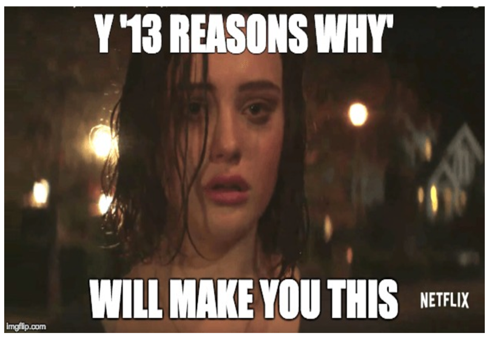

```{r setup, include=FALSE}
library("dplyr")
library("httr")
library("jsonlite")
library("knitr")
library("ggplot2")
library("tidyr")
library("mapdata")
library("plotly")
```

 |[*Home*](index.html) | [*Politics*](politics.html) | [*Tech*](tech.html) |[*Entertainment*](enter.html)| [*Fashion*](fashion.html) | Money | Health | Travel | Sports | U.S. | World |  |
 |-------|------------|--------|-----------|-----------|----|----|-----|----|-----|-----|
 
<center><h1> <u><u><br>***<u>Entertainment</u>***</u></u> <h1> 

[](http://www.cnn.com/2017/04/25/health/13-reasons-why-teen-suicide-debate-explainer/index.html) <br><br></center> 

### This article talks about why '13 reasons why' is an important topic to discuss for teens. The founder of the nonprofit Media Impact and Navigation for Teens program, Alexa Curtis suggested that for the younger generation, this show could lead them to think that this is the easy way out and the best way to get all the attention. She goes on to suggest that students should be talked about this show in all their health classes. 

### Link to the article - http://www.cnn.com/2017/04/25/health/13-reasons-why-teen-suicide-debate-explainer/index.html


<br><br><br><br>

