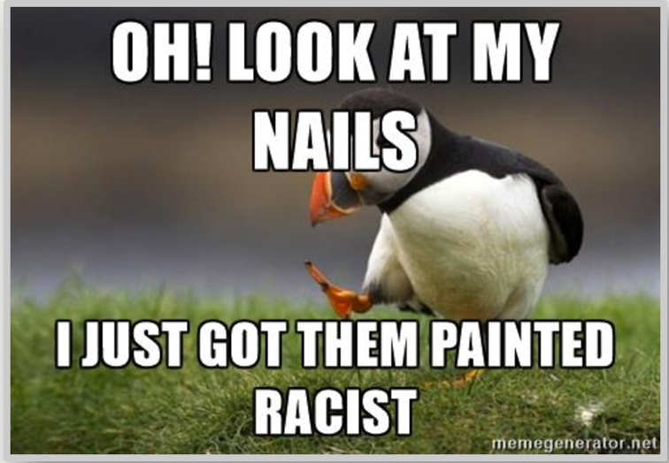

```{r setup, include=FALSE}
library("dplyr")
library("httr")
library("jsonlite")
library("knitr")
library("ggplot2")
library("tidyr")
library("mapdata")
library("plotly")
```

 |[*Home*](index.html) | [*Politics*](politics.html) | [*Tech*](tech.html) |[*Entertainment*](enter.html)| [*Fashion*](fashion.html) | Money | Health | Travel | Sports | U.S. | World |  |
 |-------|------------|--------|-----------|-----------|----|----|-----|----|-----|-----|
 
<center><h1> <u><u><br>***<u>Fashion</u>***</u></u> <h1>

[](http://money.cnn.com/2017/04/05/news/companies/nivea-white-is-purity-racist-ad/index.html?iid=surge-stack-dom) <br><br></center> 

### The German skincare maker's ad for a deodorant included a picture of a woman and the slogan "white is purity." It was posted on Nivea's Middle East Facebook page with the caption: "Keep it clean, keep it bright. Don't let anything ruin it." The post sparked a backlash, with social media users accusing Nivea of being racist and insensitive.

### "Come on Nivea. This is so racist that I do not even know where to begin. Speechless. In future, refer to clothes or products, not colors," Scott Bellows posted on Twitter.

### Beiersdorf (BDRFF), the Hamburg-based company that owns Nivea, Eucerin and other skincare brands, said it decided to take the advert down due to what it called "concerns about ethnic discrimination."

### "We are deeply sorry to anyone who may take offense to this specific post. After realizing that the post is misleading, it was immediately withdrawn," the company said in a statement. The advert was also shared by accounts that have previously posted content promoting white supremacist views.