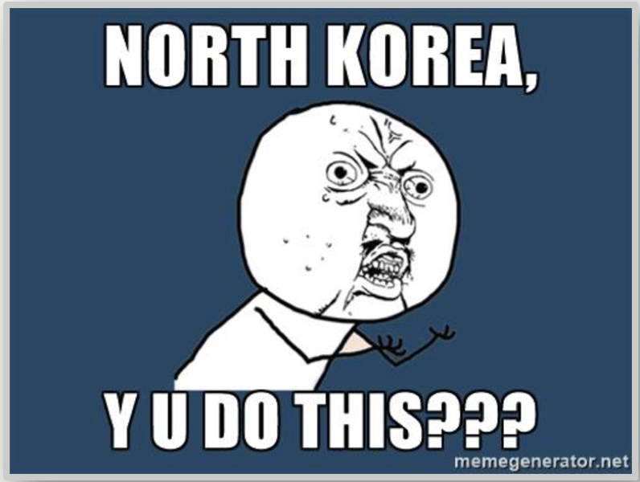

```{r setup, include=FALSE}
library("dplyr")
library("httr")
library("jsonlite")
library("knitr")
library("ggplot2")
library("tidyr")
library("mapdata")
library("plotly")
```

 |[*Home*](index.html) | [*Politics*](politics.html) | [*Tech*](tech.html) |[*Entertainment*](enter.html)| [*Fashion*](fashion.html) | Money | Health | Travel | Sports | U.S. | World |  |
 |-------|------------|--------|-----------|-----------|----|----|-----|----|-----|-----|
 
<center><h1> <u><u><br>***<u>Politics</u>***</u></u> <h1>

[](http://www.cnn.com/2017/04/25/politics/trump-north-korea-taunts/index.html) <br><br></center> 

### Washington (CNN) - North Korea put on a muscle-flexing display of artillery power Tuesday to mark a national holiday and thumb its nose at US President Donald Trump's declaration that the country has "gotta behave."

### Pyongyang staged the pounding display of large caliber guns used in land warfare -- perhaps a reminder that Seoul and its US military base lie within easy reach -- shortly after detaining an American teacher, the third US citizen held by the regime.

### The US staged its own response, beginning joint naval drills in the region with South Korea and Japan as the aircraft carrier USS Carl Vinson moved toward the Korean Peninsula and one of the most powerful submarines in the American arsenal arrived in South Korea -- part of an "armada" the US was sending to the region, Trump told the Fox Business Network in mid-April.
